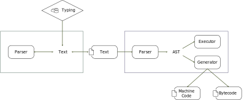

<p align="center"></p>
<hr>

Just what _is_ merman?

Traditionally, a compiler or interpreter has two main parts: the parser and backend (generator or executor).  The parser transforms human readable text (the source code) into an abstract syntax tree (AST), and the backend outputs machine code or executes the AST.



The editor operates on text, a series of bytes, which brings out difficulties:

- It is easy to make edits that break the syntax.  For example, accidentally deleting part of a keyword or an overreaching replace corrupting type names.
- Navigation makes no distinction between grammatic elements.  The cursor may end up in the middle of a word when trying to rearrange statements, jump over complex operator chains, or not jump far enough when dealing with long variable names and strings.

Some editors may include a parser to provide the editor access to the AST.  While this allows the editor to make smarter edits and colorize the text, it has some of its own drawbacks:

- A parser takes significant development resources, and a parser is needed for each supported language.
- The parser needs to be kept up to date with the compiler or risk losing significant functionality, getting in the way of work.
- Bidirectional synchronization between AST and text is complex and fragile.  Typos may make the AST unavailable or make it wildly misinterpret the code.
- Users judge languages and fight over things like whitespace decisions and block delimiters.

Using a series of bytes as source code also presents problems on the compiler side:

- To create a new language need to create a parser
- To create a parser you need to decide on a syntax
- New features need new syntax constructs.  Old syntax constructs may get in the way.  Features may be compromised for the sake of syntax usability.
- Even trivial syntax changes may break compatibility.  Updating source code is often manual since automated changes may be incorrect and errors may make the source nonsensical and uncompilable.

And debugging:

- Breakpoints and tracebacks are usually line based, when a single line may consist of dozens of clauses.  Sometimes breakpoints and tracebacks are statement based, which is even less precise.
- Where grammatic elements begin and end is not always clear, making code flow hard to understand when stepping.

**merman** is an editor that operates directly on the AST in the hopes of simplifying much of the above.


merman does have something like a reverse-parser to visualize the AST in a text syntax-like manner, but it is conceptually simple.

merman aims to provide these benefits:

- No syntax errors.
- Open the road to more powerful navigation - accessibility.
- Iterate new language development faster by debinding the syntax from the AST.
- Languages can use color, font, and images to distinguish elements of the grammar.
- The user can explicitly resolve ambiguity when it arises, rather than leaving it to the compiler to guess or give up.
- AST manipulation in scripts and other programs is easy and safe.
- Better diffs
- Users can customize the syntax and add sugars to suit their workflow.
- Programming languages can be localized.

Of course, there are some drawbacks to this approach

- It's a very different way of thinking and interacting with source code.
- Communicating about source code is more difficult, especially if users customize their syntax.
- Displaying source code on the web is more difficult.
- merman is a minimal, rough proof of concept written in Java.

# Get it

Version 0.0.2

Requires Java 9.

## Jar

Download [here](https://github.com/Rendaw/merman/releases/download/v0.0.1/merman-0.0.1.jar).

Run with:
```
java -jar merman-0.0.1.jar FILENAME
```

## Build from source

Clone each of the following and this project:

- https://github.com/Rendaw/java-common
- https://github.com/Rendaw/pidgoon
- https://github.com/Rendaw/java-interface1
- https://github.com/Rendaw/java-luxem
- https://github.com/Rendaw/java-interfacedocument
- https://github.com/Rendaw/luaconf
- https://github.com/Rendaw/pidgooncommand

Create a new directory named `aggregate-merman` next to all of them and add this `pom.xml` file:
```
<project xmlns="http://maven.apache.org/POM/4.0.0"
  xmlns:xsi="http://www.w3.org/2001/XMLSchema-instance"
  xsi:schemaLocation="http://maven.apache.org/POM/4.0.0
                      https://maven.apache.org/xsd/maven-4.0.0.xsd">
  <modelVersion>4.0.0</modelVersion>
 
  <groupId>org.codehaus.mojo</groupId>
  <artifactId>merman-parent</artifactId>
  <version>2.0</version>
  <packaging>pom</packaging>
 
  <modules>
    <module>../java-common</module>
    <module>../pidgoon</module>
    <module>../java-interface1</module>
    <module>../java-luxem</module>
    <module>../java-interfacedocument</module>
    <module>../luaconf</module>
    <module>../pidgooncommand</module>
    <module>../merman</module>
  </modules>
</project>
```

Then run:
```
mvn package
java -jar standalone/target/standalone.jar FILENAME
```

# Documentation

- [Create a language in 10 minutes!](https://github.com/Rendaw/merman/wiki/Create-a-language-in-10-minutes!)
- [Syntax reference](https://github.com/Rendaw/merman/wiki/Syntax-Reference)
- [Action reference](https://github.com/Rendaw/merman/wiki/Actions-Reference)
- [Roadmap](https://github.com/Rendaw/merman/wiki/Roadmap)
